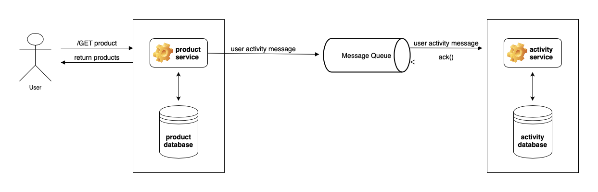
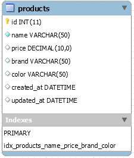
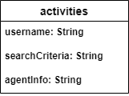
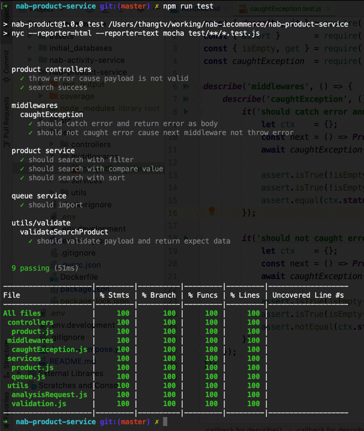
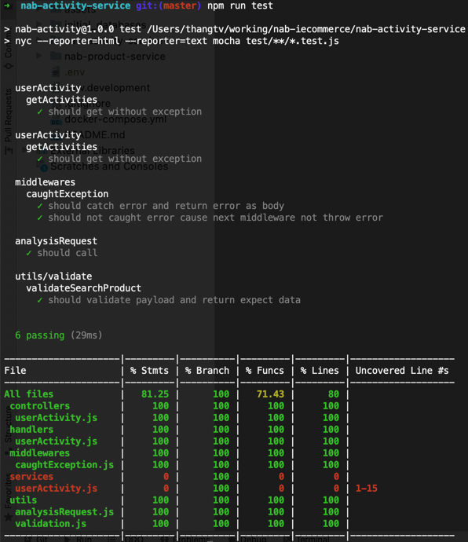

# iCommerce

## Components
### System overview

### Details

- **Product service**: serve and storage bussiness related to product.
- **Activity service**: listen **user activity** and persist to database, also serve API for marketing, analyzing.
## Database design

### Product


### User Activity


## Code structure
Structure for both services:

```
├── Dockerfile <- packaging service
├── .dockerignore
├── .env.development <- environment variables
├── .eslintrc.json <- linter config
├── .gitignore <- gitignore
├── package.json
├── src
│   ├── config <- read config from .env and storage for apps
│   ├── controllers <- config routes && register controllers for each routes
│   ├── index.js <- entry point, declare app, register middlewares, trigger databases and message queue
│   ├── middlewares <- declare middleware
│   ├── queue <- init message queue, expose publisher and scribers
│   ├── schemas <- declare db connection, define data models
│   ├── services <- this layer interactive with datababase and message queue
│   └── utils <- include utilities function
├── tests <- include unit test
```

## Framworks
- [Koa](https://koajs.com/)
- [squelize](https://sequelize.org/)
- [mongoose](https://mongoosejs.com/)
- [amqplib](https://www.npmjs.com/package/amqplib)

## Prerequisites
### For individual run
- [Node.js (v12.17.0 or higher)](https://nodejs.org)
- [MongoDB](https://www.mongodb.com/)
- [MySQL](https://www.mysql.com/)
- [RabbitMQ](https://www.rabbitmq.com/)
### For Docker
- [Docker](https://www.docker.com/)
- [docker-compose](https://docs.docker.com/compose/)

## How to run in local
### with docker-compose

1. Copy **.env.development** to **.env** at the current directory
2. Run **docker-compose up --build -d**
3. Wait a minutes, wait on the availability of a host and TCP port of Database and Message Queue containers.
4. View log by run command **docker-compose logs -f**

### without docker-compose

1. Install mongodb, mysql, and rabbitmq (1)
2. Copy .env.development to .env for each services
3. Update variables in .env file matching with connection of software (1)
4. Run **npm install** 
5. Run **npm run start** for each service.

## Test API with cURL
### 1. search all, include all field
```
curl --location --request POST 'localhost:3000/product/search' \
--header 'Content-Type: application/json' \
--data-raw '{
    "page_size": 10,
    "page_number": 1,
    "filter": []
}'
```

### 2. search all, specific field

```
curl --location --request POST 'localhost:3000/product/search' \
--header 'Content-Type: application/json' \
--data-raw '{
    "page_size": 10,
    "page_number": 1,
    "filter": [
        "id",
        "name",
        "price"
    ]
}'
```

### 3. search and sort
```
curl --location --request POST 'localhost:3000/product/search' \
--header 'Content-Type: application/json' \
--data-raw '{
    "page_size": 10,
    "page_number": 1,
    "filter": [
        "id",
        "name",
        "price"
    ],
    "sort": {
        "price": "desc"
    }
}'
```
### 4. search with value
```
curl --location --request POST 'localhost:3000/product/search' \
--header 'Content-Type: application/json' \
--data-raw '{
    "page_size": 10,
    "page_number": 1,
    "filter": [
        "id",
        "name",
        "price"
    ],
    "sort": {
        "price": "desc"
    },
    "search": {
        "brand": "Apple",
        "color": "RED"
    }
}'
```
### 5. get user activities (demonstrate activity service works well)
```
curl --location --request GET 'localhost:3001/activities' \
--header 'Content-Type: application/json'
```

## Unit test: cover >= 70%
```
npm run test
```

### Product service



### Activity service




## Code coverage detail
Locate the file **coverage/index.html** each repo and open it on Browser to see.
## Check syntax, code convention
```
npm run eslint
```
